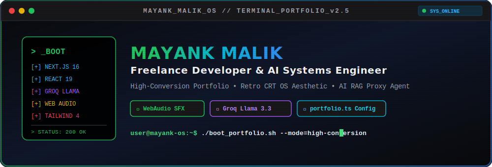
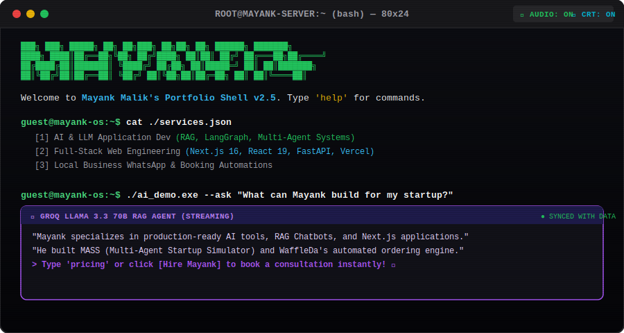
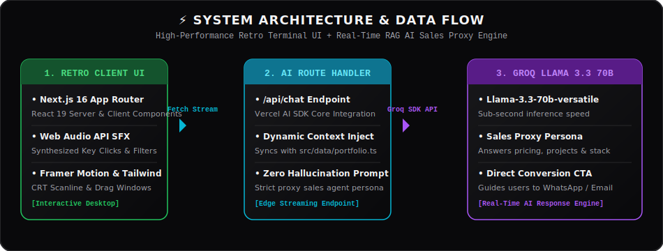

<div align="center">

<!-- RETRO CRT TERMINAL HEADER BANNER -->


<br/>
<br/>

<!-- BADGES BAR -->
[](https://nextjs.org/)
[](https://reactjs.org/)
[](https://www.typescriptlang.org/)
[](https://tailwindcss.com/)
[](https://groq.com/)
[](https://developer.mozilla.org/en-US/docs/Web/API/Web_Audio_API)
[](https://vercel.com/)
[](https://opensource.org/licenses/MIT)

<br/>

### 📟 *A Conversion-Focused Freelance Portfolio & Autonomous AI Proxy Agent built with a Retro CRT OS Aesthetic.*

[Live Demo](https://mayankmalik.vercel.app/) • [Book a Consultation](https://wa.me/918199082861) • [Report Issue](https://github.com/mayankmalik263/Services-Portfolio/issues)

</div>

<br/>


## 📌 Table of Contents

- [⚡ The Vibe & Overview](#-the-vibe--overview)
- [✨ Key Features](#-key-features)
- [💻 Terminal UI & Commands](#-terminal-ui--commands)
- [🏗️ System Architecture](#️-system-architecture)
- [🛠️ Tech Stack Matrix](#️-tech-stack-matrix)
- [🚀 Quick Start (Boot Sequence)](#-quick-start-boot-sequence)
- [⚙️ Single-File Configuration (`portfolio.ts`)](#️-single-file-configuration-portfoliots)
- [🎨 Design System & Synthesized Audio Engine](#-design-system--synthesized-audio-engine)
- [📂 Project Directory Structure](#-project-directory-structure)
- [💼 Services & Pricing Tiers](#-services--pricing-tiers)
- [👤 Author & Contact](#-author--contact)
- [📄 License & Acknowledgements](#-license--acknowledgements)

<br/>


## ⚡ The Vibe & Overview

This isn't your standard, generic minimal developer portfolio. It is engineered as a **Conversion-Optimized Retro OS Operating Environment**. Designed to immediately captivate clients, demonstrate high-end engineering capabilities, and convert visitors into high-ticket bookings.

<div align="center">
  
</div>

### 🌟 Core Highlights:
- 🖥️ **Interactive Retro Terminal OS:** Features draggable pixel-art panels, authentic CRT scanlines toggle, status lights, and desktop icons.
- 🔊 **Synthesized Web Audio Engine:** Realistic mechanical keyboard typing sound effects generated in real-time via the Web Audio API—zero `.mp3` files downloaded.
- 🤖 **Live AI RAG Sales Proxy (`ai_demo.exe`):** Integrated AI assistant powered by Groq's Llama 3.3 70B model via Vercel AI SDK. It acts as an autonomous sales agent, answering client questions dynamically based on codebase knowledge.
- 🎯 **Conversion-Oriented Design:** Clear value propositions, transparent pricing packages, and direct WhatsApp integration.

<br/>


## ✨ Key Features

| Feature | Description | Tech Highlight |
| :--- | :--- | :--- |
| **🤖 Autonomous RAG AI Proxy** | Interactive `ai_demo.exe` chatbot streaming answers about services, case studies, and pricing. Synced directly with portfolio data. | `Vercel AI SDK` + `Groq Llama 3.3 70B` |
| **🔊 Synthesized Web Audio SFX** | Zero-latency mechanical key clicks built with pure Web Audio synthesized sine waves, noise buffers, and low-pass filter decay. | `Web Audio API` + `AudioContext` |
| **🖥️ Drag & Drop Retro Windows** | Fully interactive window management system (`RetroWindow.tsx`) supporting drag, minimize, maximize, and CRT scanline toggles. | `Framer Motion` + `Tailwind CSS v4` |
| **⚡ 1-File Data Decoupling** | Modify all portfolio content (projects, pricing, bio, services) in a single TypeScript file without touching UI components. | `src/data/portfolio.ts` |
| **📱 Mobile-First Responsive** | Flawless experience across desktop monitors, tablets, and mobile devices while preserving the pixel retro vibe. | `Next.js 16` + `Responsive CSS` |
| **💬 One-Click WhatsApp Funnel** | Seamless client conversion flow connecting service choices directly to WhatsApp business messaging. | `WhatsApp Web API` |

<br/>


## 💻 Terminal UI & Commands

The portfolio features an embedded interactive terminal interface. Users can type commands or click quick action buttons:

```bash
guest@mayank-os:~$ help
```

### 📋 Available Terminal Commands

| Command | Usage / Purpose | Output / Action |
| :--- | :--- | :--- |
| `help` | List all available system commands | Displays formatted list of interactive commands |
| `projects` | View featured portfolio case studies | Renders case study list (WaffleDa, MASS, Learn AI OS) |
| `services` | View offered freelance development services | Renders AI/LLM, Web Dev, & Business Automations list |
| `pricing` | Display transparent pricing packages | Shows Starter (₹15k), Growth (₹22k), and Pro (₹35k) tiers |
| `about` | Show developer bio and education info | Displays Mayank's background (UPES AI/ML, NewCycl) |
| `contact` | Get instant contact details & WhatsApp link | Provides direct email & WhatsApp booking buttons |
| `ai_demo.exe` | Launch the Groq AI Chatbot assistant | Opens streaming AI proxy window for live Q&A |
| `clear` | Wipe terminal screen buffer | Clears console output |

<br/>


## 🏗️ System Architecture

The architecture is built around extreme speed, modularity, and zero-hallucination AI streaming.

<div align="center">
  
</div>

### 🔄 Data Flow Summary:
1. **Client Interaction:** User types commands or triggers `ai_demo.exe` in `Hero.tsx` / `LiveDemo.tsx`.
2. **Audio Synthesis:** Keypresses invoke `SoundWrapper.tsx` using Web Audio API synthesized noise buffers.
3. **AI Proxy Call:** Streaming requests are routed to `/api/chat` using `useChat` from `@ai-sdk/react`.
4. **RAG Context Sync:** `/api/chat/route.ts` injects structured context directly from `src/data/portfolio.ts`.
5. **Groq Inference:** Groq's Llama 3.3 70B streams real-time tokens back to the terminal UI with zero latency.

<br/>


## 🛠️ Tech Stack Matrix

| Layer | Technology | Badge / Version | Key Purpose |
| :--- | :--- | :--- | :--- |
| **Framework** | Next.js | `16.2.10` App Router | SSR, SSG, Edge API route handling |
| **UI Library** | React | `19.2.4` | Component architecture & modern hooks |
| **Styling** | Tailwind CSS | `v4` | Utility-first pixel styling & dark mode |
| **Animations** | Framer Motion | `12.42.2` | Window dragging, layout transitions, CRT scanlines |
| **AI SDK** | Vercel AI SDK | `4.0.23` | Native fetch streaming & unified LLM hooks |
| **LLM Provider** | Groq AI | `Llama 3.3 70B` | Blazing-fast inference for live chatbot sales proxy |
| **Audio Engine** | Web Audio API | `Native Browser API` | Synthesized mechanical keyboard audio feedback |
| **Icons** | Lucide React | `1.24.0` | Retro terminal & status indicators |
| **Language** | TypeScript | `5.0+` | Full end-to-end type safety |

<br/>


## 🚀 Quick Start (Boot Sequence)

Boot the local environment in under 2 minutes:

### 1️⃣ Clone & Install
```bash
# Clone the repository
git clone https://github.com/mayankmalik263/Services-Portfolio.git

# Navigate into project folder
cd Services-Portfolio

# Install dependencies
npm install
```

### 2️⃣ Configure Environment Variables
To enable the live AI RAG Chatbot, obtain a free API key from [Groq Console](https://console.groq.com/). Create a `.env.local` file in the root directory:

```env
GROQ_API_KEY=your_groq_api_key_here
```

### 3️⃣ Launch System
```bash
npm run dev
```
Open your browser and navigate to `http://localhost:3000` to interact with the retro OS terminal!

### 4️⃣ Production Build
```bash
npm run build
npm run start
```

<br/>


## ⚙️ Single-File Configuration (`portfolio.ts`)

The portfolio is designed so you never need to alter UI components to update your information. All dynamic content is centralized in **`src/data/portfolio.ts`**.

```typescript
// src/data/portfolio.ts

export const contactInfo = {
  whatsapp: "918199082861",
  email: "mayankmalik263@gmail.com",
};

export const heroData = {
  name: "Mayank Malik",
  headline: "I build websites and automations that turn clicks into customers.",
  subheadline: "Websites, online booking, WhatsApp automation, and AI chatbots for local businesses and startups."
};

// Services, Projects, Pricing & About Data exported cleanly...
```

> [!TIP]
> **AI Knowledge Synchronization:** The AI Chatbot backend (`src/app/api/chat/route.ts`) automatically reads from `portfolio.ts`. When you update your pricing or project list, the AI chatbot's knowledge base updates automatically!

<br/>


## 🎨 Design System & Synthesized Audio Engine

### 🎨 Color Palette

| Token Name | Hex Code | Visual Swatch | Usage |
| :--- | :--- | :---: | :--- |
| **Background Dark** | `#09090B` | ⬛ | Terminal background & dark mode base |
| **Panel Surface** | `#18181B` | ⬛ | Retro window card background |
| **Hacker Green** | `#22C55E` | 🟩 | Terminal prompts, status indicators, success states |
| **Cyber Cyan** | `#06B6D4` | 🟦 | Code highlights, tech stack tags, audio indicators |
| **Neon Purple** | `#A855F7` | 🟪 | AI RAG Chatbot accent & streaming borders |
| **Amber Warning** | `#EAB308` | 🟨 | Terminal command parameters & pricing highlights |

### 🔊 Mechanical Keyboard Audio Engine
The audio engine synthesizes mechanical switch sounds using the browser's native **Web Audio API**:
- **Frequency Click:** A brief 50ms sine wave burst centered at 1200Hz.
- **Key Down Dampening:** Low-pass filter at 800Hz simulating key travel decay.
- **Zero Network Cost:** No external MP3 files to load; 100% generated in RAM.

<br/>


## 📂 Project Directory Structure

```ascii
Services-Portfolio/
├── 📁 assets/                     # SVG Graphics (Banners, Diagrams, Windows, Dividers)
│   ├── header-banner.svg
│   ├── terminal-window.svg
│   ├── architecture-diagram.svg
│   └── divider.svg
├── 📁 public/                     # Static media & project screenshots
│   ├── profile.png
│   └── 📁 projects/               # Client project screenshots
├── 📁 src/
│   ├── 📁 app/
│   │   ├── 📁 api/
│   │   │   └── 📁 chat/
│   │   │       └── route.ts       # Groq AI RAG Streaming API Handler
│   │   ├── layout.tsx             # Main App Shell & Font setup
│   │   ├── page.tsx               # Primary Portfolio Page
│   │   └── globals.css            # Tailwind CSS v4 & Retro Scanline styles
│   ├── 📁 components/
│   │   ├── Hero.tsx               # Terminal Header & Command Line Component
│   │   ├── LiveDemo.tsx           # Groq Llama 3.3 AI Chat Window
│   │   ├── RetroWindow.tsx        # Reusable Draggable Retro Window Frame
│   │   ├── SoundWrapper.tsx       # Web Audio API Synthesizer Engine
│   │   ├── Services.tsx           # Offered Freelance Services Grid
│   │   ├── Work.tsx               # Featured Case Studies & Client Proof
│   │   ├── Pricing.tsx            # Transparent Package Cards
│   │   ├── About.tsx              # Bio & Experience Timeline
│   │   └── Contact.tsx            # Direct WhatsApp & Email Funnel
│   ├── 📁 data/
│   │   └── portfolio.ts           # 🌟 SINGLE SOURCE OF TRUTH (Content Data)
│   └── 📁 utils/                  # Helper utilities
├── .env.local                     # Environment variables (GROQ_API_KEY)
├── package.json                   # Project dependencies & scripts
├── tsconfig.json                  # TypeScript configuration
└── README.md                      # Project documentation
```

<br/>


## 💼 Services & Pricing Tiers

### 🛠️ Service Packages

```
┌──────────────────────────────────────┬─────────────────────────────────────────────────────────────┐
│ Service                              │ Value Proposition                                           │
├──────────────────────────────────────┼─────────────────────────────────────────────────────────────┤
│ 🤖 AI & LLM Application Development  │ Custom RAG Chatbots, LangGraph agents, multi-agent systems. │
│ 🌐 Full-Stack Web Development        │ Next.js 16 + React 19 + FastAPI production deployed web apps│
│ 🎮 Interactive Educational Web Apps  │ Duolingo-style gamified learning platforms (Learn AI OS).   │
│ 📱 Local Business Automations        │ Online booking, lead capture & WhatsApp support bots.       │
│ ✍️ Content Strategy & Tech Copy      │ LinkedIn roadmaps & tech scripts for AI founders.           │
└──────────────────────────────────────┴─────────────────────────────────────────────────────────────┘
```

### 💰 Transparent Pricing Tiers

| Tier | Investment | Best For | Features Included |
| :--- | :--- | :--- | :--- |
| **Starter** | **₹15,000** *(one-time)* | Small local business getting online | • Responsive Mobile-First Site<br/>• Basic SEO & Google Profile<br/>• WhatsApp & Call Buttons<br/>• 1 Year Free Domain |
| **Growth** ⭐ | **₹22,000** *(+ ₹2,000/mo)* | Businesses automating bookings | • Everything in Starter<br/>• Service Selector & Online Booking<br/>• WhatsApp Automated Ordering<br/>• Hosting & Maintenance |
| **Pro** | **₹35,000** *(+ ₹3,000/mo)* | Full digital transformation | • Everything in Growth<br/>• Custom AI Chatbot (RAG Agent)<br/>• WhatsApp Reminders & Reviews<br/>• Priority 24/7 Support |

<br/>


## 👤 Author & Contact

<div align="center">

### **Mayank Malik**
*B.Tech Computer Science Engineering (AI/ML) @ UPES Dehradun*  
*Full-Stack & AI Systems Intern @ NewCycl*

<br/>

[](https://wa.me/918199082861)
[](mailto:mayankmalik263@gmail.com)
[](https://mayankmalik.vercel.app/)

</div>

<br/>


## 📄 License & Acknowledgements

This project is licensed under the **[MIT License](LICENSE)**.

### 🙏 Acknowledgements
- [Next.js](https://nextjs.org/) for the App Router framework.
- [Vercel AI SDK](https://sdk.vercel.ai/docs) & [Groq](https://groq.com/) for sub-second LLM streaming.
- [Tailwind CSS](https://tailwindcss.com/) for utility styling.
- [Framer Motion](https://www.framer.com/motion/) for fluid terminal animations.
- [Lucide Icons](https://lucide.dev/) for retro icon components.

<div align="center">
<br/>

**Built with intent. Engineered for high conversion.**  
*© 2026 Mayank Malik. All rights reserved.*

</div>
